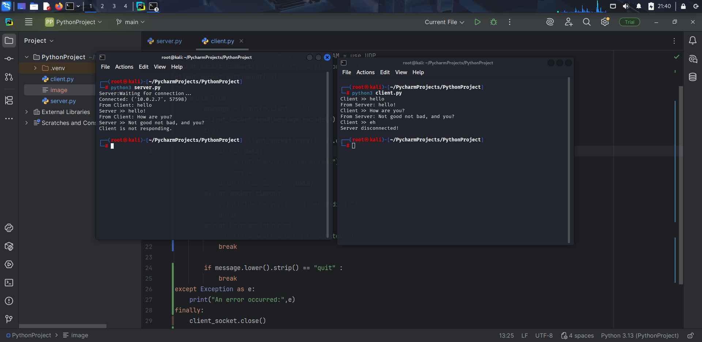

# Client-Server Project
This is simple client-server communication project. It demonstrates how a server and client communicate over sockets. A timeout feature is also added to prevent infinite waiting.
## How to run 
1. Start to server:
```bash
python3 server.py
```
2. Start to client:
```bash
python3 client.py
```
3. The client will connect to the server and exchange messages.
 
## Example
